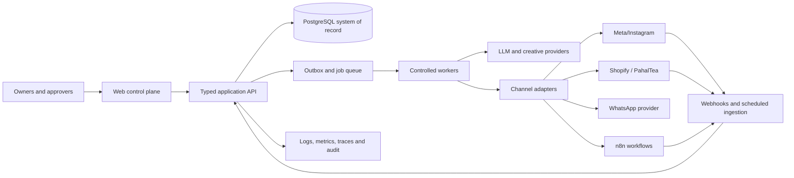

# Pahal Tea Growth Engine — Phase 1 Architecture Proposal

**Status:** planning only. No production connection, publishing, spend, messaging, or application implementation is authorised by this document.

## 1. Current repository audit

| Area | Finding |
| --- | --- |
| Tracked application files | One: `README.md` |
| Code, package manifests, tests, CI/CD, database migrations | Not present |
| Git history | One initial commit: `d7155af Create README.md` |
| Current branch | `main` |
| Remote | GitHub origin configured |
| Working tree | Clean at audit time |

The repository is an empty project scaffold. There is no existing architectural constraint other than the README mission statement. The public `pahaltea.com` URL was deliberately not accessed: the requested audit must not connect to production systems.

## 2. Architecture goals and principles

- Build an approval-first control plane: AI proposes and drafts; humans approve defined material actions; workers execute only approved work.
- Make approved product information the only source eligible for public copy.
- Keep an immutable, queryable audit trail of data ingestion, AI inputs/outputs, decisions, approvals, and side-effect attempts.
- Begin as a modular monolith to minimise delivery and operating complexity; isolate adapters so Amazon/quick-commerce and other channels can be added later.
- Separate analytical read paths from external write paths and queue every side effect.
- Store only necessary customer data, use least privilege, and support deletion/retention policies.

## 3. Proposed technology shape

The recommended initial stack is TypeScript end-to-end: Next.js web console plus a typed API (or Next.js server handlers initially), PostgreSQL, Redis-backed jobs, object storage, and a managed identity provider. A worker process executes queued analysis, ingest, generation, and approved delivery jobs. n8n runs as an integration/workflow orchestrator, not the system of record.



### Bounded modules

1. **Identity & policy:** users, roles, environment restrictions, approval policy.
2. **Brand intelligence:** products, SKUs, facts, evidence, claims, compliance review.
3. **Planning:** audience hypotheses, content pillars, briefs, calendar, campaigns and budgets.
4. **Generation:** prompt templates, retrieval from approved facts, outputs, validation, versioning.
5. **Approvals & execution:** approval requests, segregation of duties, signed execution intents, outbox/jobs.
6. **Integrations:** Shopify, Meta/Instagram, WhatsApp, n8n and later marketplaces, each an adapter.
7. **Analytics:** raw ingestion, normalised events/facts, attribution assumptions, metrics, reports.
8. **Optimisation:** constrained recommendations, experiments, decision explanations, approval routing.

## 4. Proposed repository structure

```text
apps/
  web/                         # internal owner/approval console
  api/                         # typed API, webhook ingress, auth boundary
  worker/                      # queued and scheduled jobs
packages/
  domain/                      # entities, policies, state machines
  db/                          # schema, migrations, repository layer
  integrations/                # adapter interfaces + Shopify/Meta/etc adapters
  ai/                          # retrieval, prompts, validators, provider adapters
  analytics/                   # metric definitions and transformation logic
  ui/                          # shared design system
  config/                      # validated, non-secret configuration schemas
infra/
  terraform/                   # cloud, network, databases, secrets, monitoring
  n8n/                         # version-controlled workflow exports/templates
docs/
  adr/                         # architecture decision records
  runbooks/                    # deployment, incident, integration recovery
  policies/                    # claims, approval, data retention policy
  ARCHITECTURE.md
tests/
  e2e/ contract/ fixtures/
```

Use a monorepo tool such as pnpm workspaces with Turborepo. Repository choices remain pending owner/team preference; no packages should be installed in Phase 1.

## 5. Data model

Use PostgreSQL with UUID primary keys, `organisation_id` boundaries, UTC timestamps, soft deletion where appropriate, row-level access enforced in the API, and append-only audit events. Put flexible provider payloads and model metadata in JSONB, but keep filtering/decision fields relational.

| Domain | Core entities |
| --- | --- |
| Governance | organisations, users, roles, permissions, environments, policy_rules, approval_requests, approval_steps, execution_intents, audit_events |
| Product truth | products, variants, product_facts, evidence_records, claims, claim_versions, claim_evidence_links, claim_approvals, prohibited_terms |
| Content | content_pillars, briefs, assets, content_items, content_versions, channel_adaptations, calendar_entries, review_comments, publishing_requests |
| AI | prompt_templates, retrieval_snapshots, generation_runs, generation_inputs, model_outputs, validation_results, safety_flags, evaluation_sets |
| Campaigns | channel_accounts, campaigns, ad_sets, ads, budgets, creative_versions, experiments, campaign_change_requests, execution_results |
| Commerce/customer | source_connections, customers (minimised/pseudonymised), orders, order_lines, products_snapshot, discounts, events, consent_records |
| Analytics | ingestion_runs, raw_events, metric_definitions, metric_facts, attribution_models, report_snapshots, recommendations, recommendation_outcomes |
| Operations | integration_credentials_refs, webhook_events, idempotency_keys, outbox_events, jobs, job_attempts, incidents, notifications |

Critical state machines:

- Claims: `draft → evidence_submitted → compliance_review → approved | rejected | retired`.
- Content: `draft → claim_validation → review → approved → scheduled → published | failed | archived`.
- Campaign change: `proposed → policy_evaluated → approval_required | auto_eligible → approved → queued → executed | failed | reverted`.
- Approval: `pending → approved | rejected | expired | cancelled`; execution requires an unexpired approval bound to the exact payload hash.

The exact current Masala Tea facts should be seeded only after owner review into `product_facts` and `claims`; do not encode them as unreviewed marketing copy.

## 6. AI and content engine

1. Retrieve a versioned snapshot of only approved facts/claims, approved brand voice, channel policy, and task context.
2. Generate a structured draft (copy, creative brief, rationale, cited claim IDs, prohibited-claim check), never a direct publish request.
3. Run deterministic validators (claim IDs, banned terms, required disclosures, channel character limits) plus an independent LLM critique/evaluation.
4. Store model/provider/version, prompt-template version, retrieved record IDs, hash, cost/usage, output, validation results, and reviewer feedback.
5. Route any unsupported assertion or complaint/crisis content to mandatory human review. No model may add a claim from its general knowledge.

For image/video creative, generate briefs and optional drafts in a segregated asset store. Human approval is required before any channel delivery. Use provider contracts that prohibit training on business/customer data where required.

## 7. n8n integration architecture

n8n is a workflow executor for low-risk orchestration, reminders, and connector glue; PostgreSQL remains authoritative for state, policy and approvals.

- Trigger workflows through signed, idempotent internal webhooks containing an execution-intent ID, never raw unrestricted credentials.
- n8n calls an internal API to obtain narrowly scoped, time-limited action tokens after approval validation.
- Receive n8n callbacks through a verified webhook endpoint; record event, correlation ID, payload hash, result and retry state.
- Version workflow exports in `infra/n8n`; promote through dev/staging/production with review and a dry-run mode.
- Do not let n8n approve claims, calculate authoritative metrics, store secrets in workflow JSON, or bypass application policy.

## 8. Meta and Instagram

Create a Meta adapter with separate read and write clients, isolated tokens and scopes, account allowlists, action budgets, idempotency, rate-limit handling, and webhook verification.

- Ingest Insights, account/campaign/ad hierarchy, spend, performance, comments and publishing results into raw and normalised stores.
- Start read-only and sandbox/test assets. Publish organic posts, reply to comments, create/alter campaigns, and spend only from approved execution intents.
- Treat comments containing complaints, safety, quality, refund, legal, harassment, or crisis signals as escalation-only drafts; never auto-reply.
- Preserve provider IDs and reconcile writes against scheduled ingestion.

## 9. Shopify / PahalTea.com

Confirm the platform and store ownership before implementation. If Shopify is confirmed, use a custom app with narrowly scoped Admin API permissions and verified webhooks.

- Initial scope: read products, inventory availability if needed, orders, customers only where lawful/necessary, discounts, and analytics-related events.
- Use webhooks plus periodic reconciliation; retain raw payloads for a limited period and normalise them into commerce facts.
- Any storefront, pricing, inventory, customer, checkout, theme, or discount write is a separately gated capability and defaults off.
- Attribute web conversions using explicit UTM/campaign identifiers and documented attribution windows; do not overstate causal attribution.

## 10. WhatsApp notifications and approvals

Use a WhatsApp Business API provider only for opt-in, template-compliant transactional alerts to internal approvers initially. The application is the approval authority.

- Notification contains a short context, risk, expiry and secure deep link to the console; approval happens after authenticated review in the console.
- Do not put customer data, secrets, full content, or approval tokens in WhatsApp messages.
- Log delivery and acknowledgement separately from the approval decision. Support email/in-app fallback and escalation schedules.
- Customer messaging remains out of scope until consent, templates, policy, and customer-support workflow are approved.

## 11. Analytics and optimisation

Ingest immutable raw source data, transform it to normalised daily/hourly metric facts, and expose metric definitions beside every report. Track source freshness, time zone, currency, sampling, late arrivals, and attribution method.

Recommended initial metrics: revenue, orders, AOV, conversion rate, repeat purchase, refund/cancellation rate, CAC, MER, ROAS, CPM, CTR, CPC, frequency, engagement rate, content reach, and approved-claim/content performance. Each recommendation must show evidence, confidence, constraints, forecast/expected trade-off, and a reversible action proposal.

Optimisation starts as a recommendation engine. Policy permits automatic *analysis* and alerts only. Experiment creation, budget changes, targeting changes, creative activation and pauses require approval unless a future explicit policy grants a narrow pre-approved reversible range.

## 12. Security, secrets and permissions

- Use SSO/MFA; roles: Owner, Compliance Approver, Marketing Approver, Analyst, Operator, Developer, Auditor, and read-only Viewer.
- Enforce least privilege, separation of duties, maker-checker approvals and environment isolation. An approver cannot approve their own material campaign change.
- Store provider credentials in managed secrets; applications receive short-lived references/identity, never hardcoded values. Rotate, revoke and audit access.
- Encrypt data in transit and at rest; protect webhook endpoints with signatures, timestamp/replay checks, IP/rate controls and idempotency keys.
- Minimise PII, pseudonymise analytics identities, document lawful basis/consent, retention/deletion schedules, DSAR support, backups, restore tests and access reviews.
- Send structured logs/metrics/traces to monitored storage; redact secrets and PII. Alert on failed executions, policy denials, unusual spend, webhook failures and privilege changes.

## 13. Mandatory human approval gates

| Action | Required approval |
| --- | --- |
| New/changed product claim or claim without approved evidence | Compliance/Owner |
| Any organic publishing or standard scheduled content | Marketing Approver (until a future auto-publish policy is expressly approved) |
| Complaint/crisis public response | Owner or designated Crisis Approver |
| New campaign, material targeting/creative/bid change, pause/resume | Marketing Approver; Owner when major |
| Spend rise beyond configured absolute/percentage threshold | Owner + Marketing Approver |
| Destructive/irreversible data or external action | Owner plus relevant operator |
| Production deployment, schema migration, credential rotation | Owner/Release Approver |

Define thresholds, "major change", approver delegation, emergency process and expiry times as explicit versioned policies before enabling execution.

## 14. Development, testing and deployment strategy

Use dev, staging and production environments with distinct projects/accounts, databases, secrets, domains and Meta/Shopify test resources. Feature flags should keep every write integration disabled by default.

- Unit test domain policy/state machines and claim validators.
- Contract-test every provider adapter with recorded/sanitised fixtures and provider sandboxes.
- Integration-test outbox/idempotency/retry/webhook signature paths.
- End-to-end test approval-to-execution flow only against mocks/sandboxes; test policy denial and failure/reversal paths.
- Evaluate AI prompts against a curated approved/unsupported-claim set; require regression thresholds before promotion.
- CI: lint, type-check, tests, dependency/security scan, secret scan, migration validation, build, infrastructure plan.
- CD: reviewed artefact promotion, staging smoke test, approval gate, canary/feature flag release, monitored rollback. Production deploys require a recorded approval.

## 15. Phased roadmap

| Phase | Outcome | Exit criteria |
| --- | --- | --- |
| 1 — Discovery & governance | Approved facts/claims inventory, policies, architecture, account inventory, data map | Owner signs decisions in this document; no production connections |
| 2 — Foundation | Monorepo, auth/RBAC, DB/migrations, audit/outbox, environments, CI/CD, feature flags | Approval and audit paths tested with mocks |
| 3 — Brand & content control plane | Claim catalogue, evidence/review, briefs, content calendar, AI drafting/validation | Unsupported claims cannot reach approval/publishing workflow |
| 4 — Read-only data integrations | Shopify confirmation/read ingestion and Meta/Instagram insights ingestion | Reconciled metrics and verified webhook/security tests in staging |
| 5 — Reporting & recommendations | Dashboard, metric definitions, campaign/content recommendations, alerts | Recommendations trace to source data and are non-executing |
| 6 — Approval-driven activation | Draft publishing and campaign change execution in sandbox, n8n/WhatsApp internal notifications | End-to-end gated, idempotent, reversible tests pass |
| 7 — Controlled production pilot | Narrow channel/account allowlist, low-risk approved actions, monitoring/runbooks | Owner accepts pilot limits and incident process |
| 8 — Optimisation & expansion | Experiment framework, guarded automation, Amazon/quick-commerce adapters | Channel-specific policy, contracts and data quality approved |

## 16. External accounts, APIs, credentials and permissions

| Integration | Needed later | Minimum purpose/permission |
| --- | --- | --- |
| Cloud/IAM | Cloud account, DNS, managed DB/Redis/object storage/queue/secrets/monitoring | Environment-scoped service identities; no shared admin keys |
| Identity | SSO/MFA provider | Users, groups, OIDC/SAML; role mapping |
| AI providers | Enterprise/project account and API key | Text/vision/generation APIs; data-use settings reviewed |
| Meta | Business Manager, app, verified business, Facebook Page, Instagram professional account, ad account, system user | Read Insights first; publishing/ads scopes only after approval design and app review |
| Shopify (if confirmed) | Store-owner-approved custom app | Read products/orders/analytics; webhooks; all write scopes disabled initially |
| WhatsApp | Meta WhatsApp Business Account or BSP, verified number/templates | Internal approver templates only; customer messaging later and consent-bound |
| n8n | Hosted/self-hosted environment, OAuth connections | Separate environment credentials; signed internal webhooks |
| Email/observability | Transactional email, error tracking/logging/metrics | Internal alerts and operational monitoring |
| Amazon / quick-commerce | Seller/vendor/partner accounts and channel approvals | Defer until Phase 8; channel-specific scopes and commercial terms |

Obtain legal/privacy review, data-processing agreements, platform app-review approvals, terms acceptance, and named business owners before production credentials are created.

## 17. Risks and owner decisions required before implementation

### Principal risks

- Unsupported product claims and consumer-protection/platform-policy violations.
- Misconfigured tokens or automation causing unauthorised publishing, spend, or customer contact.
- Poor attribution/data quality causing harmful optimisation recommendations.
- PII/consent/retention failures across Shopify, Meta and WhatsApp.
- Workflow drift between n8n and the application system of record.
- Over-reliance on generative output, model drift, and inadequate human review.
- Unknown storefront platform, analytics configuration, existing channel account ownership, and contractual restrictions.

### Decisions requiring owner approval

1. Approve the claim catalogue wording and evidence standard, including the meaning/evidence behind "Ethically Grown" and whether it may be used publicly.
2. Confirm legal entity, jurisdiction, privacy policy, retention periods, consent approach and designated compliance/crisis approvers.
3. Confirm PahalTea.com platform, ownership and which data/write capabilities may ever be enabled.
4. Name Meta Business Manager/Page/Instagram/ad-account owners; approve sandbox/pilot accounts and spend thresholds.
5. Select cloud, identity, AI, WhatsApp and n8n hosting providers; approve budgets and data-processing terms.
6. Set approval thresholds, major-change definition, required approver quorum, delegation and emergency procedures.
7. Decide whether initial content publishing remains fully manual (recommended) and define acceptable pilot actions.
8. Confirm metric definitions, attribution windows/time zone/currency, source systems and reporting audience.
9. Approve the proposed TypeScript modular-monolith direction or specify stack/compliance constraints.

